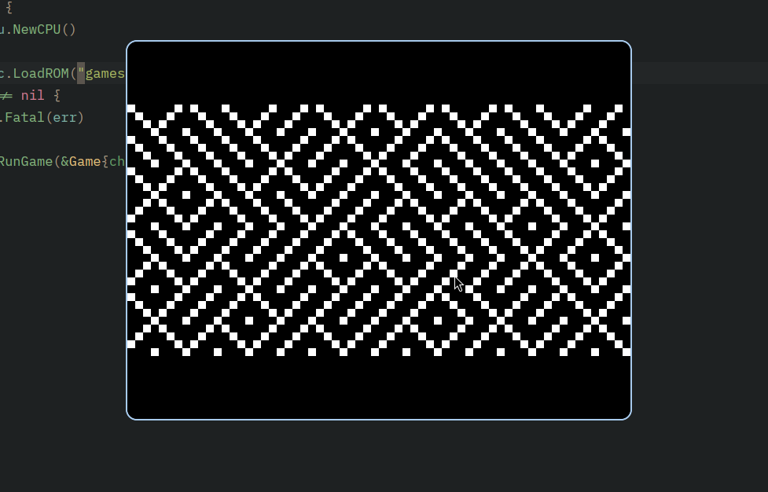

#  CHIP-8 Go Emulator
> A high-performance, pixel-perfect CHIP-8 interpreter written in Go using the Ebitengine game framework.

  
   
  <i>"Tried low-level emulation and systems programming."</i>

## Overview
This project is a complete implementation of the **CHIP-8 interpreted programming language** first used on 1970s microcomputers like the COSMAC VIP. Built with a focus on **clean architectural patterns** and **precise hardware emulation**, this emulator features:

- **Complete Instruction Set**: Full implementation of all 35 standard opcodes.
- **Cycle-Accurate Timing**: Logic running at 500-700Hz with 60Hz timers.
- **High-Performance Rendering**: Direct RGBA pixel-buffer manipulation via Ebitengine.
- **Cross-Platform**: Compiles to a single binary for Linux, macOS, and Windows.

## Architecture
The emulator is divided into distinct, decoupled modules:

- **CPU**: The "brain" of the system, handling the Fetch-Decode-Execute cycle and register state.
- **Memory**: A 4KB address space including reserved font data and ROM storage.
- **Display**: A 64x32 monochrome buffer using XOR logic for sprite rendering and collision detection.
- **Keypad**: A 16-key hex input system mapped to modern QWERTY layouts.

## Controls
The original CHIP-8 hex keypad is mapped to the modern keyboard as follows:

| CHIP-8 | PC Key | | CHIP-8 | PC Key |
|:---:|:---:|:---:|:---:|:---:|
| **1** | `1` | | **C** | `4` |
| **4** | `Q` | | **D** | `R` |
| **7** | `A` | | **E** | `F` |
| **A** | `Z` | | **F** | `V` |
| **2** | `2` | | **3** | `3` |
| **5** | `W` | | **6** | `E` |
| **8** | `S` | | **9** | `D` |
| **0** | `X` | | **B** | `C` |

## 🚀 Getting Started

### Prerequisites
- [Go](https://go.dev/doc/install) 1.21 or higher
- C compiler (required for Ebitengine dependencies)

## 🛠️ Implementation Details
- **The "Burst-Step" Pattern**: To achieve 500Hz+ while maintaining a 60Hz render loop, the engine executes 8-10 CPU cycles per frame.
- **Bitwise Shifting**: Opcodes are decoded using high-speed masking and bit-shifting logic for maximum efficiency.
- **Hardware Fonts**: Built-in 80-byte font set loaded into the "reserved" memory space (0x000-0x1FF).

---
*Developed as a deep-dive into Go fundamentals and systems architecture.*
